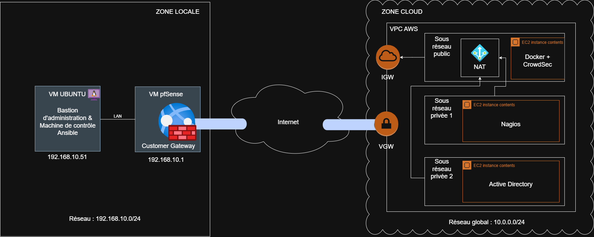

# Projet d'Infrastructure Hybride Sécurisée & Automatisation DevOps (IaC)

Ce projet implémente l'automatisation, le déploiement et la sécurisation d'une architecture d'entreprise hybride. Il fait la passerelle entre un environnement local sécurisé et un environnement de production hébergé sur le Cloud AWS.

L'intégralité du provisionnement et de la configuration des rôles serveurs est orchestrée via l'**Infrastructure as Code (IaC)** avec **Ansible**.

---

## Architecture du Réseau

L'infrastructure s'articule autour de deux zones principales interconnectées par un **tunnel VPN IPSec sécurisé** :
*   **Zone Locale (Réseau `192.168.10.0`) :** Poste administrateur, simulation VirtualBox et Pare-feu PfSense.
*   **Zone Cloud AWS (Réseau global `10.0.0.0`) :** Découpée en trois sous-réseaux métiers :
    *   **Sous-réseau Exposé (Public) :** Serveur Docker + Système de prévention des intrusions (IPS) CrowdSec.
    *   **Sous-réseau Services :** Serveur de supervision Nagios.
    *   **Sous-réseau Identité :** Contrôleur de domaine Windows Server (Active Directory AD-DS).



---

## Stack Technique

*   **Orchestration / IaC :** Ansible, Ansible-Navigator, YAML
*   **Conteneurisation :** Docker, Docker-Compose
*   **Systèmes d'exploitation :** Linux (Ubuntu), Windows Server
*   **Sécurité & Réseaux :** VPN IPSec, PfSense, CrowdSec, SSH
*   **Supervision :** Nagios, Apache, PHP

---

## Structure du Dépôt

```text
├── collections/               # Collections Ansible installées
│   └── requirements.yml       # Dépendances des rôles et collections
├── inventory/                 # Gestion de l'inventaire et des environnements
│   ├── group_vars/            # Variables globales partagées par groupe de serveurs
│   │   ├── all.yml            # Variables communes à toute l'infrastructure
│   │   ├── production.yml     # Variables propres à l'environnement AWS
│   │   └── test.yml           # Variables propres aux conteneurs Docker locaux
│   ├── host_vars/             # Variables de configuration spécifiques à chaque machine
│   │   ├── server1_prod.yml / server1_test.yml
│   │   ├── server2_prod.yml / server2_test.yml
│   │   └── server3_prod.yml / server3_test.yml
│   └── hosts.yml              # Cartographie des hôtes de Test et de Production
├── .gitignore                 # Exclusion des fichiers sensibles (clés privées, logs)
├── ansible-navigator.yml      # Configuration de l'environnement d'exécution isolé
├── ansible.cfg                # Paramètres globaux d'Ansible (chemins, dossiers temporaires)
├── devfile.yaml               # Configuration de l'espace de travail de développement
├── Dockerfile                 # Image Ubuntu personnalisée pour simuler les instances EC2
├── playbook_server_windows.yml # Playbook dédié aux tests Windows
├── print_helloworld_playbook.yml # Script de test pour apprendre la logique ansible
├── projet_hybride_playbook_test.yml # Scénario de test global pour le banc d'essai local
├── projet_hybride_playbook.yml # Playbook maître pour le déploiement de Production
└── README.md                  # Documentation technique du projet
```

## Guide d'Exécution et d'Utilisation

Ce projet comporte deux phases distinctes : un environnement de validation locale (banc d'essai Docker pour simuler les hôtes) et un environnement de production réel (AWS).

### 1. Préparation du Banc d'Essai Local (Environnement Test)

Avant de déployer sur AWS, l'environnement local permet de valider la connectivité SSH et les configurations Linux.

```bash
# 1. Construire l'image Docker intégrant le serveur SSH
docker build -t monimage .

# 2. Instancier les conteneurs de simulation (server1, server2 et server3)
docker run -d --name ec2_simulation_1 -p 2221:22 monimage && \
docker run -d --name ec2_simulation_2 -p 2222:22 monimage && \
docker run -d --name ec2_simulation_3 -p 2223:22 monimage
```

### 2. Validation de la Connectivité Ansible

Une fois les conteneurs lancés ou les instances AWS démarrées, validez le bon fonctionnement de la liaison avec le playbook d'initiation :

```bash
# Lancer le test de connectivité "Hello World"
ansible-navigator run print_helloworld_playbook.yml -i inventory/hosts.yml --mode stdout
# Lancer le playbook test principal 
ansible-navigator run projet_hybride_playbook_test.yml -i inventory/hosts.yml --mode stdout
```

### 3. Exécution du Déploiement Réel (Production AWS)

Une fois les configurations validées sur le banc d'essai local, vous pouvez lancer le déploiement sur l'infrastructure Cloud réelle. Grâce à la séparation stricte de l'inventaire (`hosts.yml`) et des variables (`group_vars` / `host_vars`), Ansible basculera automatiquement sur l'environnement de production.

```bash
# Lancer le déploiement de production complet sur les instances AWS
ansible-navigator run projet_hybride_playbook.yml -i inventory/hosts.yml --mode stdout
```

## Vidéo de Démonstration du Projet

Une démonstration vidéo complète de l'infrastructure est disponible :

**[Cliquez ici pour visionner la vidéo de démonstration (Google Drive)] (METS_TON_LIEN_ICI)**
